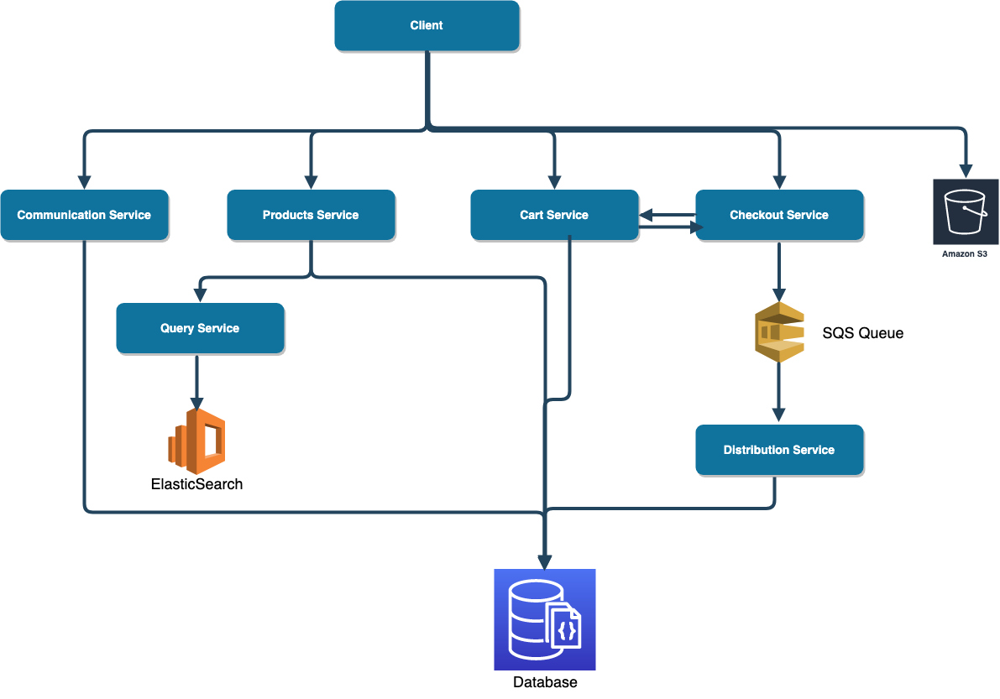

# ShopperStar
ShopperStar is an online store that consists of 6 services (SpringBoot) in the backend and a decoupled frontend (React). It is deployed to an AWS EC2 instance (along with AWS S3, AWS Route53, and Nginx). CI/CD pipeline was set up for the project in AWS CodeBuild and AWS CodeDeploy.

## For Website Access
ShopperStar can be accessed at http://shopperstar-project.com/ You need to login with your Google account in order to get access to your cart

 ### References
 The following [template](https://colorlib.com/wp/template/sublime/) was re-used to build ShopperStar. This template was re-written with react.
